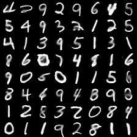
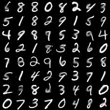

# IFT6266 Deep Learning Course Project on Conditional Image Generation

For details about the project: [Project Website](https://ift6266h17.wordpress.com/project-description/)

## Feedforward Modeling (Without Captions)

For starters, I tried to just fit a regular convolutional neural network. 
I believe in this particular problem, P(inner | outer, caption) is not very multimodal.
So, it should _technically_ be possible that a vanilla CNN gives good results.
However, this was not the case.

The following samples are completions of MNIST digits. As you can see, the feedforward model almost perfectly is able to model the inner square.

The model consists of 9 residual blocks wtih different dilation factors. Each residual block has 4 resolution-preserving convolutional layers, where the first and last layers use 1x1 filters (NiNs) with linear activation, and the middle layers use 3x3 filters with elu activation. The input to the residual block is added to the output. An extra last layer uses sigmoid activation layers.

|   |   |
|---|---|

- Train set completions

- Validation set completions

The model is still training, and hopefully should iron out the salt-and-pepper noises as well. The model has only a linear layer at the end, so perhaps using a sigmoid would help with the noise we see.

## Bayes error rate
The success in feedforward modeling of MNIST was not seen in the case of MSCOCO, which makes me wonder whether the bottleneck in deep generative modeling of images is the models or the data. Consider an experiment where we use some dimensionality reduction technique to reduce images into 15-20 dimensions (or whatever intrinsic dimensionality is necessary). And then we attempt to fit a network which just maps from the reduced vector to the full image. This does not require any special modeling framework, since p(image | reduced_vector) should be unimodal, and a feedforward network should suffice. I strongly believe that for MNIST, this would work fantastically, and wouldn't work for MSCOCO. Does this not imply a weakness in the dataset, as opposed to a weakness in the models? My thoughts are unstructured, but it would be interesting to come up with an apparatus to measure an upperbound of generative modeling for different datasets.
