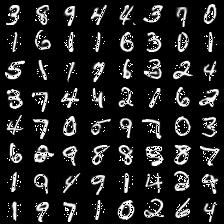
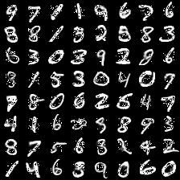

# IFT6266 Deep Learning Course Project on Conditional Image Generation

For details about the project: [Project Website](https://ift6266h17.wordpress.com/project-description/)

## Feedforward Modeling (Without Captions)

For starters, I tried to just fit a regular convolutional neural network. 
I believe in this particular problem, P(inner | outer, caption) is not very multimodal.
So, it should _technically_ be possible that a vanilla CNN gives good results.
However, this was not the case.

The following samples are completions of MNIST validation set. As you can see, the feedforward model almost perfectly is able to model the inner square.

- Train set completions

- Validation set completions

